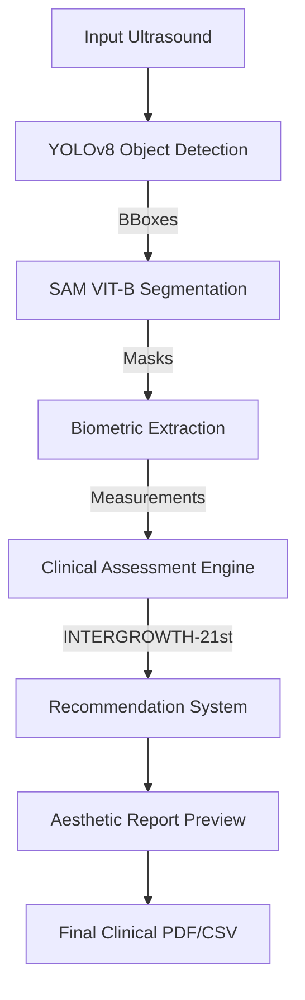

# 🏥 CradleMetrics: AI-Driven Precision Ultrasound
### Clinical Biometrics • Automated Segmentation • Professional Reporting

CradleMetrics is a specialized computer vision pipeline designed to automate fetal biometric extraction from ultrasound images with clinical-grade accuracy. It leverages state-of-the-art Deep Learning models to identify, segment, and assess fetal development against International Standards.

---

## 🛰️ System Architecture & Flow

CradleMetrics operates as a multi-stage pipeline, ensuring that every pixel is analyzed with clinical context.

### 1. Detection (YOLOv8)
The pipeline begins with a custom-trained **YOLOv8** model that identifies the specific biometric plane (Head, Abdomen, or Femur) with high confidence.

### 2. Segmentation (Segment Anything Model - SAM)
Using the detections as prompts, **SAM** (Vision Transformer - Base) generates high-fidelity masks of the fetal anatomy, allowing for sub-millimeter precision in boundary detection.

### 3. Biometric Extraction
The system calculates:
- **HC (Head Circumference)**
- **AC (Abdominal Circumference)**
- **BPD (Biparietal Diameter)**
- **FL (Femur Length)**
*Results are automatically converted from pixels to millimeters based on calibrated ultrasound headers.*

### 4. Clinical Assessment (INTERGROWTH-21st)
Measurements are compared against the **INTERGROWTH-21st** global standards to determine:
- **Centiles**: Exact percentile ranking for gestational age.
- **Classification**: Normal (AGA), Small (SGA), or Large (LGA).
- **Consistency**: Agreement between different biometric markers.

---

## 📂 Project Structure

- `web_app/`: The professional Flask dashboard and results management.
- `automatic_pipeline.py`: The core engine integrating Detection and Segmentation.
- `clinical_rules.py`: Logic for INTERGROWTH-21st and growth pattern detection.
- `recommendations.py`: Generates clinical follow-up plans and summaries.
- `report_generator.py`: Generates professional PDF reports with `reportlab`.
- `sam_processing/`: Specialized vision modules for mask refinement.
- `config/`: Thresholds and clinical standards configuration.

---

## 🛠️ Technology Stack

- **Core**: Python 3.9+, PyTorch
- **Vision**: YOLOv8 (Ultralytics), Segment Anything Model (Meta AI)
- **Web**: Flask, Vanilla JS (Aesthetic Glassmorphism UI)
- **Reporting**: ReportLab (PDF), PyYAML
- **Standards**: INTERGROWTH-21st, WHO Fetal Growth Standards

---

## 📈 Key Clinical Features

- **Automated Flags**: Real-time alerts for growth restriction or macrosomia.
- **Intelligent Resumption**: Unique session IDs allow doctors to return to an analysis without re-uploading.
- **Visual Evidence**: Side-by-side comparison of original scans and AI-generated segmentations.
- **Premium Documentation**: One-click generation of professional medical reports.

---
*CradleMetrics is designed for research and clinical assistance purposes. Always verify AI-generated measurements with manual clinical assessment.*
