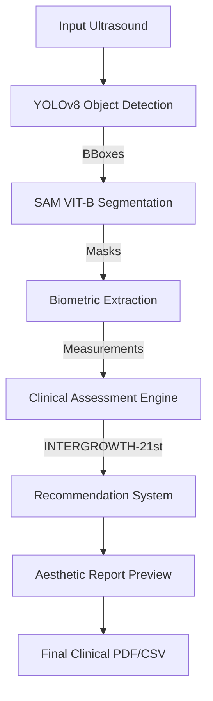

# 🏥 CradleMetrics: AI-Driven Precision Ultrasound
### Clinical Biometrics • Automated Segmentation • Professional Reporting

CradleMetrics is a specialized computer vision pipeline designed to automate fetal biometric extraction from ultrasound images with clinical-grade accuracy. It leverages state-of-the-art Deep Learning models to identify, segment, and assess fetal development against International Standards.

---

## 🛰️ System Architecture & Flow

CradleMetrics operates as a multi-stage pipeline, ensuring that every pixel is analyzed with clinical context.



### 1. Detection (YOLOv8)
The pipeline begins with a custom-trained **YOLOv8** model that identifies the specific biometric plane (Head, Abdomen, or Femur).

### 2. Segmentation (Segment Anything Model - SAM)
Using the detections as prompts, **SAM** (Vision Transformer - Base) generates high-fidelity masks of the fetal anatomy.

### 3. Biometric Extraction
The system calculates:
- **HC (Head Circumference)**
- **AC (Abdominal Circumference)**
- **BPD (Biparietal Diameter)**
- **FL (Femur Length)**

### 4. Clinical Assessment (INTERGROWTH-21st)
Measurements are compared against **INTERGROWTH-21st** global standards to determine centiles and clinical classifications (AGA, SGA, LGA).

---

## 📊 Key Features (v2.0)

- **Extended Metrics**: EFW (Hadlock 4), Cephalic Index (CI), and Amniotic Fluid Index (AFI) support.
- **Doppler Analytics**: UA-PI, MCA-PI, and CPR calculation with risk triage.
- **AI Quality Scoring**: Automated validation of anatomical planes with confidence scores.
- **Professional Dashboard**: Aesthetic glassmorphism UI for real-time analysis and history tracking.
- **Clinical Reporting**: One-click generation of professional medical PDF reports.

---

## ⚡ Quick Start

### 1. Installation
```powershell
pip install -r requirements.txt
pip install reportlab PyYAML  # For PDF reporting
```

### 2. Launch
```powershell
python web_app/app.py
```
Navigate to `http://localhost:5000` to start analyzing scans.

---
*CradleMetrics is designed for research and clinical assistance purposes. Always verify AI-generated measurements with manual clinical assessment.*
